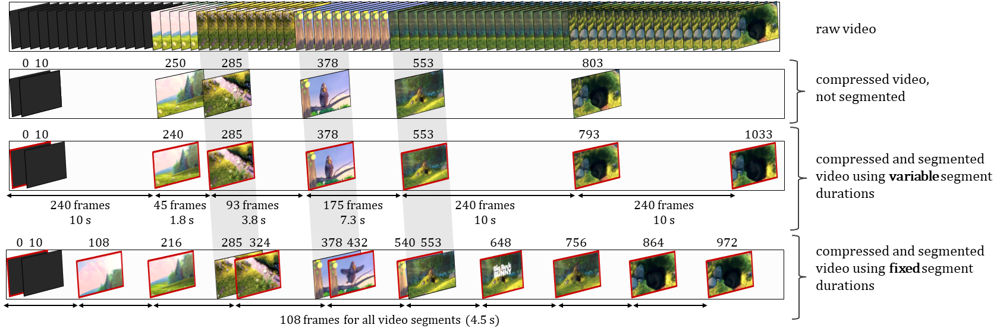

# Comparing Fixed and Variable Segment Durations for Adaptive Video Streaming

*Susanna Schwarzmann, Nick Hainke, TU Berlin*  
*Thomas Zinner, NTNU - Norwegian University of Science and Technology*  
*Christian Sieber, TU Munich*  
*Werner Robitza, Alexander Raake, TU Ilmenau*  

A holistic comparison of fixed and variable segment durations within the adaptive video streaming eco-system. We provide a large-scale investigation of video encoding efficiency to quantify the savings with respect to bitrate and storage for variable segment durations. Moreover, measurements with a variety of different bandwidth configurations are performed in a testbed to evaluate the impact of segment duration variability on the performance of the dash.js reference implementation.

## Video Encoding

HAS services typically utilize a fixed segment duration. Due to the content-agnostic placement of I-frames at the beginning of each segment, additional encoding overhead is introduced. In order to mitigate this overhead, variable segment durations, which take scene-cuts during the video seg- mentation process into account, have been proposed recently. As a consequence, a lower number of I-frames is needed as compared to fixed segment durations, thus achieving a lower video bitrate without quality degradation.

In this work, we provide a setup for video encoding making use of Docker.
It automatically assigns encoding tasks from a job pool to a set of workers, which start a Docker container and encode videos according to the job description. 

Inststructions and sources for the usage of the docker encoding environment and for creating job files for the encoding container can be found in the following GitHub repositories:
* [Usage of docker encoding environment](https://github.com/fg-inet/docker-video-encoding)
* [Creating job files for encoding container](https://github.com/fg-inet/video-scripts)

## DASH Streaming

We furthermore provide the streaming testbed, which is used to compare the performance of videos with variable segment durations with videos of fixed segment durations. 
It consists of three virtual machines. 
   * The __server__, which hosts the video content 
   * The __netem__, which throttles the bandwidth, as for example defined by traces 
   * The __client__, which uses DASH.js to stream the video

Instructions and all necessary sources for setting up the streaming environment can be found in the following GitHub repository: 
* [DASH-streaming-setup](https://github.com/fg-inet/DASH-streaming-setup)

## Dataset 
The dataset is available here: https://zenodo.org/record/3732206.
It provides on the one hand the encoding results, and on the other hand, the videos which have been used for the video streaming experiments. 

